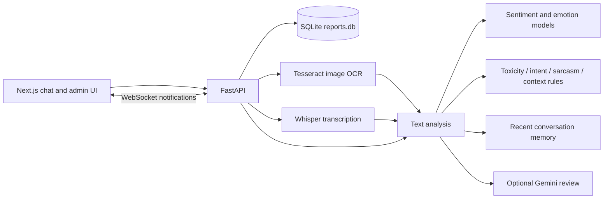

# cybershield-ai

**A chat and moderation prototype that analyzes text, text in images, and transcribed voice messages.**

cybershield-ai pairs a Next.js chat interface with a FastAPI backend. The backend combines sentiment and emotion models, keyword/rule-based toxicity and context engines, recent conversation history, and optional Gemini review. An administrator interface displays reports, moderation evidence, analysis history, account warnings, and blocking controls.

**Status:** development prototype. The API does not enforce authenticated sessions or administrator permissions, passwords are stored directly, and several moderation and upload paths require hardening. Use the implementation boundaries below when evaluating the project.


## Watch demo video

https://youtu.be/209lOzWqFpU?si=6I7pB9ueGTCgFlLO

## Contents

- [Capabilities](#capabilities)
- [Architecture and moderation pipeline](#architecture-and-moderation-pipeline)
- [Local setup](#local-setup)
- [Configuration and data](#configuration-and-data)
- [Using the application](#using-the-application)
- [API map](#api-map)
- [Training experiment](#training-experiment)
- [Repository layout](#repository-layout)
- [Validation](#validation)
- [Known limitations](#known-limitations)

## Capabilities

| Area | Implemented behavior |
| --- | --- |
| Chat | User registration/login screens, one-to-one conversation views, typing events, message status controls, and WebSocket notifications. |
| Text analysis | Preprocessing, attempted English translation, sentiment and emotion classification, toxicity/intent/sarcasm rules, and context evaluation. |
| Context | Recent in-memory messages plus SQLite conversation lookup, with relationship and repetition heuristics. |
| Optional Gemini review | Sends the current message, recent conversation, and local metadata for a JSON moderation decision. Local context results provide fallback when review fails or no key is configured. |
| Image-text analysis | Tesseract OCR followed by the same text-analysis pipeline. This does not classify harmful visual content without readable text. |
| Voice analysis | Whisper `base` transcription followed by text analysis. It does not evaluate acoustic tone or speaker identity. |
| Moderation records | Analysis history, user-submitted reports, text/image/voice evidence, warnings, and account block/unblock actions. |
| Export | Downloads user reports as an Excel workbook. |
| Webhook experiment | Includes verification and event-handling routes, with schema and validation gaps described below. |

## Architecture and moderation pipeline



The frontend uses Next.js 16.2.6, React 19.2.4, TypeScript, and Tailwind CSS 4. The backend uses FastAPI, SQLite, Transformers/PyTorch, OpenCV/Pillow, Tesseract, Whisper, and pandas/openpyxl for exports.

For a nonempty message, `analyze_text()` attempts translation when the text does not match its English-character heuristic. It limits translated input to 1,500 characters and passes the first 512 characters to sentiment and emotion classification. Local engines calculate toxicity, intent, sarcasm, relationship, and contextual signals.

The sentiment pipeline leaves its model selection at the Transformers default. Emotion uses `j-hartmann/emotion-english-distilroberta-base`. Model identifiers containing publisher names are technical dependencies, not project credits.

The service merges database and in-memory history, then supplies the last ten conversation entries to Gemini when configured. It requests `gemini-2.5-flash` with a 15-second HTTP timeout. A successfully parsed Gemini response supplies the final decision; otherwise the local context result is used. These are repository-configured model choices, not a guarantee of provider availability or measured moderation accuracy.

## Local setup

### Prerequisites

- Node.js 20.9+ and npm for Next.js 16.
- Python 3.11 as a setup baseline; wheel availability depends on OS and architecture.
- Tesseract OCR installed as a system executable.
- FFmpeg available on `PATH` for Whisper audio decoding.
- Network access and sufficient disk/memory for model downloads on initial startup.
- An optional Gemini API key for external contextual review.

### Clone and install

```bash
git clone https://github.com/quixoticalcoder/cybershield-ai.git
cd cybershield-ai
python3 -m venv .venv
source .venv/bin/activate
pip install -r backend/requirements.txt
```

On Windows, activate with `.venv\Scripts\activate`.

The backend directory is now `backend/`. Python imports remain under the `app` package. The requirements file is a pinned environment snapshot, including older translation/HTTP libraries; a resolver succeeding does not establish that every integration works on every platform.

### Configure OCR and Gemini

```bash
cd backend
cp .env.example .env
```

Set `GEMINI_API_KEY` in `backend/.env` if you want Gemini review. Without it, the service uses its local context fallback.

The OCR service currently hardcodes `/opt/homebrew/bin/tesseract`. If Tesseract is installed elsewhere, update `pytesseract.pytesseract.tesseract_cmd` in `app/services/image_service.py` to your executable path. Verify FFmpeg separately with `ffmpeg -version`.

### Start the API

From `backend/`, with the virtual environment active:

```bash
python -m uvicorn app.main:app --host 127.0.0.1 --port 8000
```

Run from this directory because SQLite and upload paths are relative to the working directory. Importing the app creates its tables and upload directories and initializes the AI services. First startup may download sentiment, emotion, and Whisper model weights and take substantially longer than later starts.

Check the API after startup:

```bash
curl http://127.0.0.1:8000/
```

The root endpoint returns a running message. It is not an independent model/provider health check. Interactive API schemas are available at `http://127.0.0.1:8000/docs`.

### Start the frontend

In a second terminal, from the repository root:

```bash
cd frontend
npm ci
npm run dev
```

Open the URL printed by Next.js, normally `http://localhost:3000`. The browser code hardcodes `http://127.0.0.1:8000` and the corresponding WebSocket address. There is no frontend API-origin environment variable at present. Remote hosting requires changing those URLs; otherwise each browser tries to connect to its own machine.

## Configuration and data

| Resource | Behavior |
| --- | --- |
| `backend/.env` | Loaded through python-dotenv for `GEMINI_API_KEY`. |
| `backend/reports.db` | SQLite users, messages, reports, evidence, and analysis history. Created during startup. |
| `backend/uploads/images/` | Uploaded image files. |
| `backend/uploads/voices/` | Uploaded voice files. |
| `/uploads` | Public static route exposing saved uploads. |
| `backend/cybershield-ai-reports.xlsx` | Generated report export; rewritten by `/export`. |
| Conversation/connection state | Stored in process memory and lost on restart; not shared among workers. |

Database files, uploads, exports, and local secrets are ignored by Git. Back up a database before changing schema or exercising destructive administrative actions. The app uses ad hoc `CREATE TABLE` and `ALTER TABLE` statements rather than versioned migrations.

`seed_demo.py` is empty. There is no seeded user dataset or supported seed command. No external messages are sent by repository validation.

## Using the application

1. Register test accounts through the chat screen.
2. Log in and select another user to open a conversation.
3. Compose text or submit an image/voice file. The frontend calls analysis and then separate delivery/evidence endpoints.
4. Review the returned decision and the recorded conversation.
5. Use the administrator interface to inspect reports, context, evidence, analysis history, warnings, and blocked accounts.
6. Export submitted reports when needed.

The login handler treats the username `admin` as an administrator. Signup does not reserve that name, and the backend does not enforce admin authorization. This is demonstration routing, not secure role-based access control.

Evidence handling is not uniform across modalities. Image and voice evidence count previous evidence records and block an account at ten strikes; warning counters and manual blocking are separate mechanisms. The dashboard's `messages_blocked` value counts evidence records rather than proving the number of uniquely blocked messages.

## API map

Paths are relative to `http://127.0.0.1:8000`.

| Group | Representative endpoints |
| --- | --- |
| Account UI | `POST /signup`, `/login`, `/logout`; `GET /users/{current_user}` |
| Chat | `POST /send-message`, `/send-image`, `/send-voice`; `GET /messages/{username}`, `/conversation/{sender}/{receiver}` |
| Typing and notifications | `POST /typing`, `/stop-typing`; `WS /ws/{username}` |
| Analysis | `POST /analyze`, `/image`, `/voice` |
| Evidence | `POST /evidence`, `/image-evidence`, `/voice-evidence`; `GET /evidence` |
| User reports | `POST /report`; `GET /reports`, `/report-context/{report_id}` |
| Moderation | `PUT /report/{report_id}/status`, `/user/{username}/warn`, `/user/{username}/block`, `/user/{username}/unblock` |
| Review and export | `GET /analysis-history`, `/dashboard-stats`, `/export` |
| Webhook | `GET /webhook`, `POST /webhook` |

Example text analysis:

```bash
curl -X POST http://127.0.0.1:8000/analyze \
  -H 'Content-Type: application/json' \
  -d '{"text":"Thanks for helping with the project.","sender":"demo_a","receiver":"demo_b"}'
```

`/analyze` writes analysis history and updates conversation memory. Repeated preview calls therefore affect context. Image and voice endpoints accept multipart `sender`, `receiver`, and `file` fields. Many application failures return a JSON failure flag with HTTP 200; callers must inspect the response body.

The send endpoints trust submitted usernames and `blocked` fields. They do not independently establish that the caller is the sender or that the content passed analysis. Do not treat a UI block as an enforced API moderation boundary.

## Training experiment

`download_data.py` requests the `civil_comments` dataset through the Hugging Face `datasets` library and writes `toxic_data.csv`. `train_model.py` converts toxicity scores above `0.5` into binary labels, splits data with a fixed random seed, fits a 5,000-feature TF-IDF vectorizer and logistic regression model, and writes `model.pkl` and `vectorizer.pkl`.

These artifacts are included, but the current live text service does not load them. The training script does not print held-out evaluation results. `datasets`, `scikit-learn`, and `joblib` are additional dependencies for these standalone scripts and are not listed in the backend snapshot. Model/serialization version compatibility is not recorded. Only load trusted serialized artifacts.

## Repository layout

```text
cybershield-ai/
├── backend/
│   ├── app/
│   │   ├── main.py                 API, tables, uploads, chat, moderation
│   │   ├── database.py             Shared SQLite connection and cursor
│   │   ├── models/schemas.py       Schema module
│   │   └── services/               NLP, OCR, transcription, rules, context
│   ├── .env.example
│   ├── requirements.txt
│   ├── download_data.py
│   ├── train_model.py
│   ├── model.pkl
│   ├── vectorizer.pkl
│   └── seed_demo.py                Empty placeholder
└── frontend/
    ├── app/page.tsx                Chat, login, and integrated admin UI
    ├── app/admin/page.tsx          Additional admin route
    ├── app/components/admin/      Review and administration components
    ├── app/layout.tsx             Metadata and fonts
    ├── package-lock.json
    └── README.md
```

## Validation

Frontend commands:

```bash
cd frontend
npm run build
npm run lint
```

The production build passes. ESLint currently reports **60 errors and 9 warnings**, including type and React-related issues. The build is not a substitute for a clean lint run.

Backend checks:

```bash
python -m pip check
python -m compileall -q backend
```

There is no maintained automated test suite or CI workflow in the repository. Isolated API checks with mocked inference can validate database and response plumbing without downloading models or sending content to providers. They do not establish OCR quality, transcription accuracy, moderation quality, or live integration reliability.

## Known limitations

- **Authentication and authorization:** passwords are plaintext, no session/token is issued, admin actions have no access guards, and usernames/WebSocket identities come from the client.
- **Uploads:** filenames are used directly in filesystem paths, with no application-level size limits or robust content validation. Uploads are publicly served and can overwrite matching filenames.
- **Failure handling:** image analysis can reference an unset `bullying` variable when OCR fails. Other routes mix failure envelopes and exceptions. Gemini JSON is parsed without a strict decision schema.
- **Webhook experiment:** verification uses a hardcoded token, POST events lack signature verification, and report inserts refer to `name` and `email` columns absent from the declared reports table. Errors are caught while the route still returns an OK status.
- **Concurrency:** a shared SQLite connection/cursor and process-local dictionaries are used across requests. Blocking inference and I/O run inside async handlers. Multiple workers do not share online, typing, or conversation state.
- **Privacy and retention:** message history, OCR, transcriptions, and provider responses can be logged. Translation and optional Gemini review transmit content externally. There is no automatic upload/log retention policy.
- **Model boundaries:** keyword heuristics and sentiment are not reliable proof of abuse or intent. Emoji-only text is handled as empty, translation can fall back silently, and no reproducible accuracy/fairness evaluation is included.
- **Deployment:** CORS allows all origins, frontend origins are hardcoded, and OCR points to a macOS-specific executable path. These settings need review before remote use.

## Contributing and license

Keep the project name `cybershield-ai` consistent in UI text, metadata, and documentation. Prioritize authenticated identities, server-side moderation enforcement, safe uploads, database isolation, and measured evaluation before adding production claims.

No project-wide license file is included. Review code, dataset, model, and third-party asset terms before reuse or redistribution.
